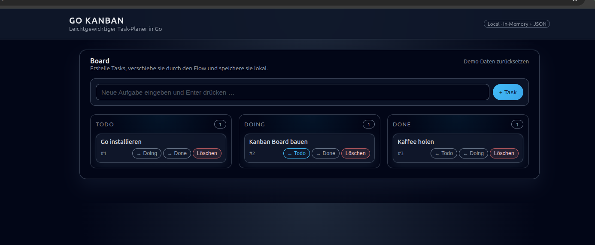

# 🧭 Go Kanban Board

Ein leichtgewichtiges **Kanban-Board** geschrieben in **Go (Golang)** — läuft als schlanker lokaler Webserver, speichert Tasks in einer JSON-Datei und kann optional in einem **Docker-Container** betrieben werden.

 <!-- optional: füge später dein eigenes Bild hier ein -->

---

## 🚀 Features

- 📝 Drei Spalten: **Todo**, **Doing**, **Done**
- ➕ Aufgaben hinzufügen, verschieben oder löschen
- 💾 Automatisches Speichern in `tasks.json`
- 🎨 Modernes Dark-UI (reines HTML + CSS)
- 🐳 Docker-Support für einfache Bereitstellung
- ⚙️ Keine externen Dependencies — nur Standardbibliothek von Go

---

## 🧩 Voraussetzungen

- **Go** ≥ 1.23  
  Installation unter Linux Mint / Ubuntu:
  ```bash
  sudo apt install golang-go

- **Docker**
  Installtion unter Linux Mint / Ubuntu:
  ```bash
  sudo apt install docker.io